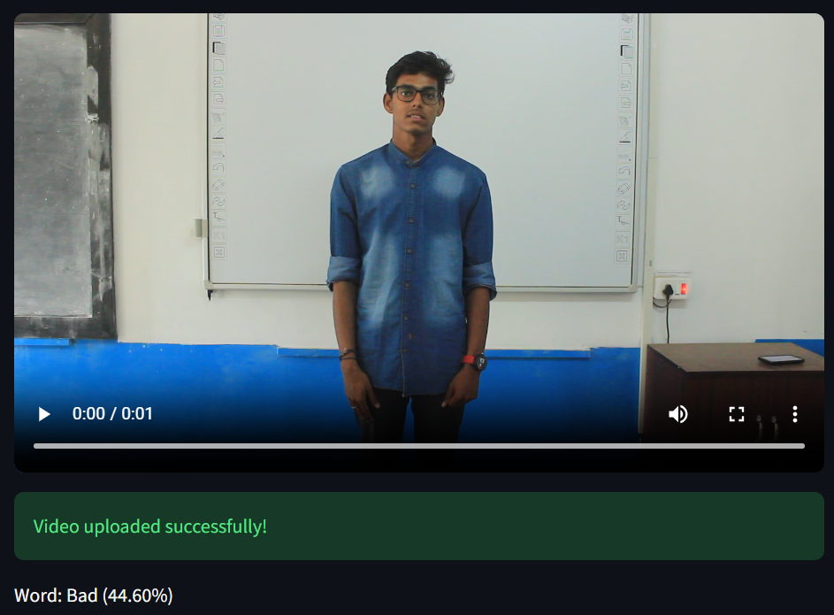
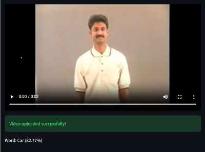
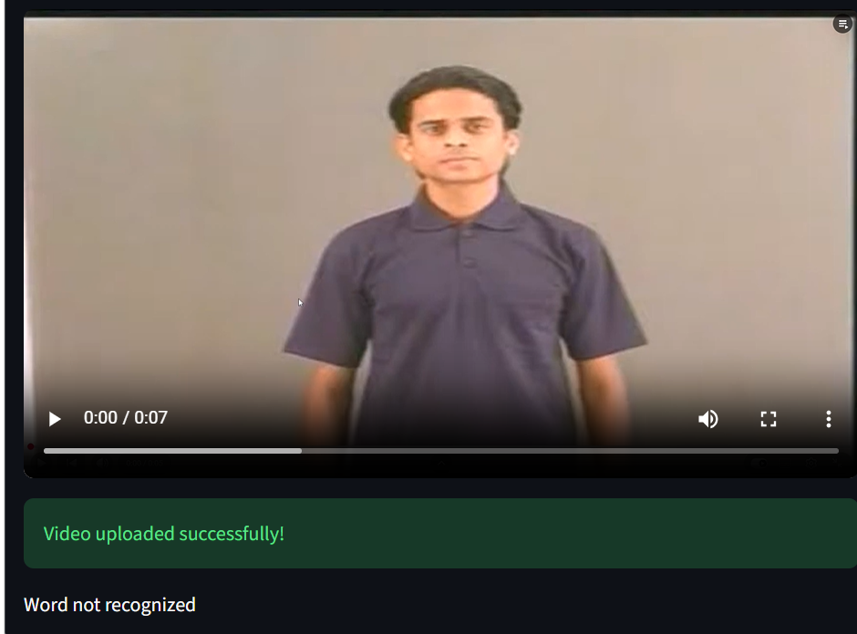
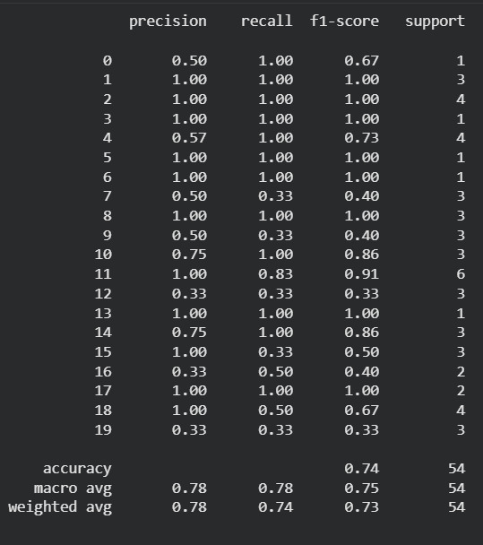

# Indian Sign Language (ISL) Word Level Recognition
Translating the hand gesture video input into word using computer vision and deep learning.

## Overview
This project focuses on word level Indian Sign Language (ISL) recognition using the **INCLUDE dataset**. The model was trained on 20 distinct sign words. Each video was processed into sequences of frames, from which Mediapipe hand, face and pose landmarks were extracted and stored into array containing of total 1659 features. To maintain a consistent input length of 75 frames padding and downsampling techniques were used. These landmark sequences were then used to train an LSTM model.

The model achieved a test accuracy of 74.07% and a validation accuracy of 85.45%.

A local Streamlit web application was developed for interactive interface allowing users to upload sign language video and get real-time word prediction from their local environment.

## Problem Statement
The project aims to bridge the gap between the individuals who rely on Indian Sign Language and non-signers by developing a local interface capable of recognizing ISL words from video inputs and translate them into text.

## Dataset
[INCLUDE Dataset](https://zenodo.org/records/4010759)
| Class | Total Video |
| ----- | ----------- |
| Bad|21|
| Car|20|
| Cat|20|
| Cell_Phone|14|
|Cold|20|
| Expensive|8|
| Father|20|
| Friend|20|
| Happy|21|
| Hello|21|
| Hospital|20|
| How_Are_You|21|
| Money|14|
| Monsoon|14|
| Mother|20|
| Pocket|20|
| Red|20|
| Thankyou|21|
| Time|15|
| Today|14|

**Total Videos 364**

**Min Video Length 1.44s**

**Max video Length 6.16s**

### Streamlit Demo

## Model Training and Performance
### Data Splitting
| Data | Percentage | Total video|
|------|------------|------------|
| Train | 70 | 255 |
| Validation | 15 | 55 |
| Test | 15 | 54 |

### Metrics
**Test Accuracy: 74.07%**

**Validation Accuracy: 85.45%**

### Classification Report

### Summary
The model achieved a perfect precision score and f1-score for several classes and scored lower (0.33) due to low sample availability.

## How to Run the Project
### Steps
Follow these steps to set up and launch the application locally on your pc.
1. Download the following files:
   
   a) dependencies (install requirements.txt file)

   b) trained keras model (isl_recognition_model.keras)

   c) mediapipe_taskfiles (hand, face, and pose task files)

   d) python script (streamlit_app.py)
4. Run the streamlit application in the terminal of the folder where these files are saved (command: streamlit run streamlit_app.py)

## Future work

The project can be expanded by

-adding more training videos per word.

-increasing the vocabulary to recognize full sentences, continuous signing.

-upgrading the local streamlit application to live camera feed to process in real time.

 

